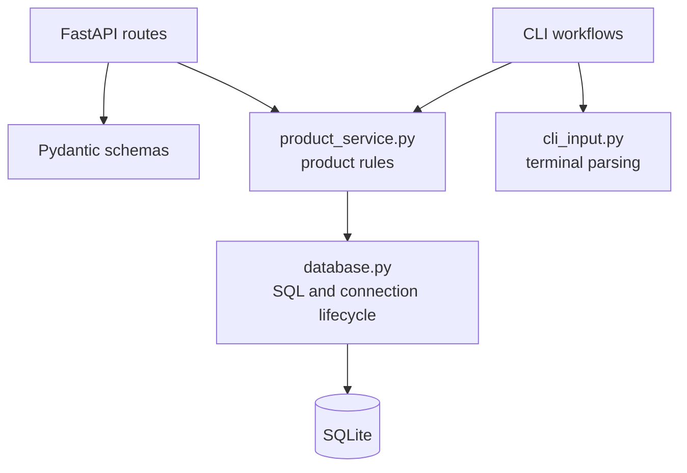

# 📦 Product Management System


A product management project built with Python, FastAPI, and SQLite. It provides
an interactive terminal interface and an HTTP API for managing products.

This is a learning and portfolio project for practicing backend development,
database integration, CRUD operations, validation, project organization, and
automated testing. It is not presented as a production-ready system.

## 🎬 Quick Demo

<p align="center">
  
</p>

## 🚀 Current Features

- Product creation, listing, lookup, update, and deletion
- REST API built with FastAPI
- Interactive terminal interface in Portuguese
- SQLite persistence
- Exact ID lookup and partial-name search
- CLI reports for average price and products above a minimum price
- Request validation with Pydantic
- Automated tests with Pytest

## 🛠 Technologies

- Python 3.14
- FastAPI
- SQLite
- Pydantic
- Uvicorn
- Pytest
- HTTPX for API tests

The current development baseline uses **Python 3.14.3**. Use Python 3.14.3 to
reproduce the verified local environment.

## 🌎 Language

The application interface is currently available in Portuguese. Project
documentation and technical descriptions are written in English.

## 📂 Project Structure

```text
Product-Management-System/
├── assets/                 # Demo assets
├── schemas/                # Pydantic API models
├── tests/                  # Automated database and API tests
├── api.py                  # FastAPI application and routes
├── cli.py                  # Interactive terminal workflows
├── cli_input.py            # Terminal input parsing and validation
├── constants.py            # CLI labels, prompts, and messages
├── database.py             # SQLite connection and data operations
├── main.py                 # CLI entry point
├── product_service.py      # Shared product business rules
├── requirements.txt        # Pinned direct dependencies
├── README.md
└── STRUCTURE.md            # Detailed architecture documentation
```

See [STRUCTURE.md](STRUCTURE.md) for the current module responsibilities and
data flow.

## ⚙️ Setup

### 1. Clone and enter the repository

```powershell
git clone https://github.com/paulo-sempio-neto/Product-Management-System.git
cd Product-Management-System
```

### 2. Create the canonical virtual environment

```powershell
py -3.14 -m venv .venv
```

The canonical environment directory for this project is `.venv`.

### 3. Activate it on Windows PowerShell

```powershell
.\.venv\Scripts\Activate.ps1
```

For Windows Command Prompt:

```bat
.venv\Scripts\activate.bat
```

### 4. Install the pinned dependencies

```powershell
python -m pip install -r requirements.txt
```

## ▶️ Run the CLI

With `.venv` activated:

```powershell
python main.py
```

The terminal menu provides the currently implemented product-management
operations.

## 🌐 Run the API

With `.venv` activated:

```powershell
python -m uvicorn api:app --reload
```

The API is available at:

```text
http://127.0.0.1:8000
```

FastAPI's interactive documentation is available at:

```text
http://127.0.0.1:8000/docs
```

## 🗄 Database

The application uses SQLite. The database layer creates the `products` table
when the CLI starts or during the FastAPI application lifespan.

Local runtime database files are ignored by Git and should not be committed.
Automated tests create isolated databases under pytest's temporary directory.

## 🧪 Run the Tests

With `.venv` activated:

```powershell
python -B -m pytest -q -p no:cacheprovider
```

The test suite uses temporary SQLite databases and covers API behavior, shared
product rules, CLI workflows, and database lookups.

## 📚 Development Goals

This project is intended to demonstrate and improve:

- Python backend development
- REST API development
- SQLite integration
- CRUD design
- Input and request validation
- Automated testing
- Incremental software maintenance

## 🔮 Possible Future Improvements

- Expand operational observability
- Expand validation and database integrity rules
- Add authentication and authorization
- Add product categories and inventory information
- Create a frontend interface
- Add Docker support
- Add deployment automation (CI quality checks are already configured)
- Deploy the application

## 👤 Author

**Paulo Sempio Neto**

GitHub: https://github.com/paulo-sempio-neto

## Engineering Quality

### Architecture Overview



The API owns HTTP concerns, the CLI owns terminal interaction, the service
layer owns product rules, and the database layer owns SQLite operations.

### Local Development

Use the existing local setup instructions above to create and activate `.venv`.
Install the development toolchain, including the application dependencies, with:

```powershell
python -m pip install -r requirements-dev.txt
```

Run the CLI with `python main.py`, or start the API with
`python -m uvicorn api:app --reload`. Interactive API documentation is at
`http://127.0.0.1:8000/docs`.

### Tests and Coverage

Run the full isolated test suite:

```powershell
python -B -m pytest
```

Run it with a terminal coverage report and missing-line information:

```powershell
python -B -m pytest --cov --cov-report=term-missing
```

Coverage is used to identify meaningful gaps, not as a standalone percentage
target. Further coverage should focus on complete CLI menu workflows and
concurrent product operations. Rollback, configuration, API error handling,
and terminal-input validation have dedicated regression tests.

### Quality Checks

```powershell
python -m ruff format --check .
python -m ruff check .
python -m mypy
```

Run `python -m ruff format .` to apply formatting. GitHub Actions runs the
format, lint, strict type-check, and pytest-with-coverage commands on every
push and pull request.

## Configuration and Operational Behavior

Both API and CLI read validated process environment variables through `config.py`.
Development retains the existing defaults. `.env.example` documents the variables;
the application does not load `.env` automatically. Set these before starting a
process; restart the API after configuration changes.

| Variable | Default | Purpose |
|---|---|---|
| `APP_ENV` | `development` | `development`, `testing`, or `production` |
| `DB_NAME` | `produtos.db` in development | SQLite file path; must be explicit in testing and production |
| `SQLITE_TIMEOUT` | `5` | Lock wait in seconds, greater than zero and at most 60 |
| `API_DOCS_ENABLED` | `true`, except in production | Enables `/docs`, `/redoc`, and `/openapi.json` |

Relative database paths resolve from the working directory. Use an absolute path
for a stable location in production. The containing directory must already exist.
Invalid settings fail startup. In-memory SQLite is not supported by configuration
because operations use separate connections. Selecting `testing` requires a path;
it does not itself create or manage test isolation (pytest fixtures do that).

Example PowerShell configuration for a separate local database:

```powershell
$env:APP_ENV = "development"
$env:DB_NAME = "local-products.db"
$env:SQLITE_TIMEOUT = "5"
python -m uvicorn api:app --reload
```

`GET /health` is a readiness probe: it checks read access to the existing products
table and returns `200 {"status":"ok"}` or a sanitized `503`. It neither creates
a missing database nor verifies write access. Normal startup still initializes
the table. Existing CRUD paths, success payloads, and error status codes remain.

Error responses retain `detail` and add `error.code`, for example:

```json
{"detail":"Produto não encontrado","error":{"code":"not_found"}}
```

Validation failures retain a `detail` list with `loc`, `msg`, and `type`, but omit
submitted `input` and internal `ctx` values. Boolean and non-finite prices are
rejected with 422. Numeric price strings remain accepted for compatibility.
Internal failures return generic messages; server logs record failure categories
without request bodies or database paths. HTTP error headers such as `Allow`
are preserved. Error schemas and route groups are included in OpenAPI.

## Security and Reliability Scope

SQL parameters are bound rather than interpolated. Connections use explicit
transactions, rollback on exceptions, and close after each operation. Unique-name
violations are distinguished from other integrity failures. Update/delete checks
detect a product removed between the initial lookup and the write. Schema
migrations and changes to existing database files are not part of this phase.

The application remains unauthenticated: callers can access all CRUD operations.
Do not expose it to untrusted clients yet. Listing and name search remain
unpaginated, and request-body limits and rate limiting are not implemented.
Those abuse protections need a separate compatibility and deployment design;
disabling API docs is not access control. SQLite still serializes writers, and
multi-step service operations are not a single transaction or protected by
optimistic locking. These are explicit limits of the current portfolio baseline.
