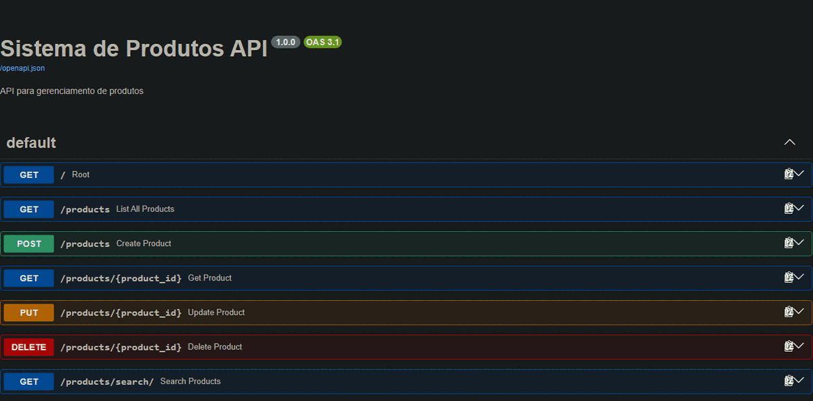

# 📦 Product Management System


A product management system built with **Python**, **FastAPI**, and **SQLite**.

This project provides a complete solution for managing products through a terminal interface and a REST API. It was developed to practice backend development concepts, database integration, CRUD operations, software organization, and automated testing.


## 🎬 Quick Demo

<p align="center">
  
</p>


---

# 🚀 Features

- Complete CRUD operations for products
- REST API built with FastAPI
- SQLite database integration
- Terminal-based product management interface
- Automated tests with Pytest
- Product search and filtering
- Data persistence
- Modular project structure

---

# 🛠 Technologies

- Python
- FastAPI
- SQLite
- Pydantic
- Uvicorn
- Pytest

---

# 🌎 Language

The application interface is currently available in **Portuguese**.

The project documentation and technical descriptions are written in **English**.

---

# 📂 Project Structure

The project follows a modular architecture, separating responsibilities between different files.

```
Sistema_Produtos/
│
├── tests/                  # Automated tests
│
├── api.py                  # FastAPI application
├── database.py             # Database connection and operations
├── funcoes_produtos.py     # Product business logic
├── menu.py                 # Terminal interface
├── main.py                 # Application entry point
├── constants.py            # Application constants
│
├── README.md
└── STRUCTURE.md             # Detailed architecture documentation
```

For a detailed explanation of the project architecture:

[STRUCTURE.md](STRUCTURE.md)

---

# ⚙️ Installation

## Clone the repository

```bash
git clone https://github.com/paulo-sempio-neto/Sistema_Produtos.git
```

## Access the project folder

```bash
cd Sistema_Produtos
```

## Install dependencies

```bash
pip install fastapi uvicorn pydantic pytest
```

---

# ▶️ Running the Application

## Terminal Interface

Run:

```bash
python main.py
```

The terminal interface allows users to manage products through the available menu options.

---

# 🌐 Running the API

Start the FastAPI server:

```bash
uvicorn api:app --reload
```

The API will be available at:

```
http://127.0.0.1:8000
```

Interactive API documentation:

```
http://127.0.0.1:8000/docs
```

---

# 🗄 Database

The application uses **SQLite** for data persistence.

The database layer is responsible for:

- Creating database tables
- Storing product information
- Updating product records
- Removing products
- Retrieving stored data

The project was migrated from JSON-based storage to SQLite to improve reliability and data management.

---

# 🧪 Testing

The project includes automated tests using **Pytest**.

Run the test suite:

```bash
pytest
```

---

# 📚 Development Concepts

This project was created to practice:

- Backend development with Python
- REST API development
- Database integration
- CRUD architecture
- Code organization
- Automated testing
- Software maintenance

---

# 🔮 Future Improvements

Possible improvements for future versions:

- Add authentication and authorization
- Create a frontend interface
- Add product categories
- Improve API validation
- Add Docker support
- Deploy the application online
- Add CI/CD automation

---

# 👤 Author

**Paulo Sempio Neto**

GitHub:

https://github.com/paulo-sempio-neto
